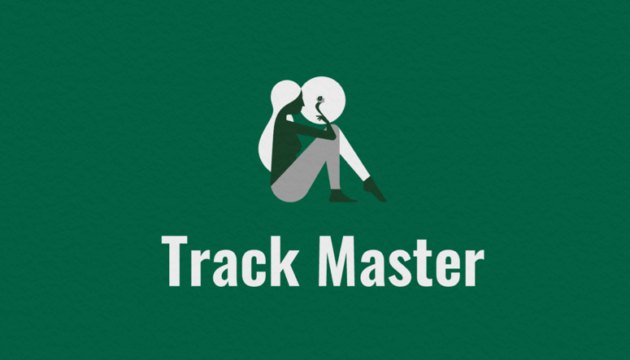
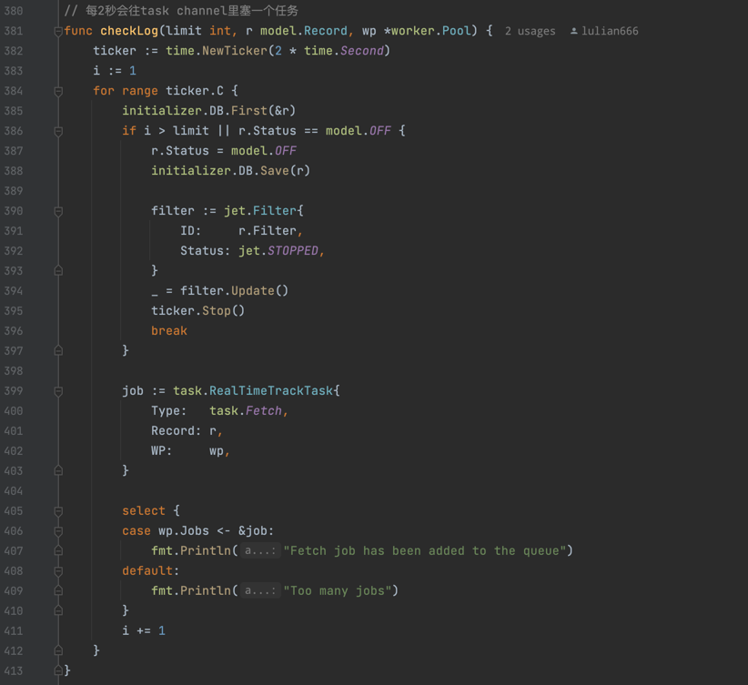
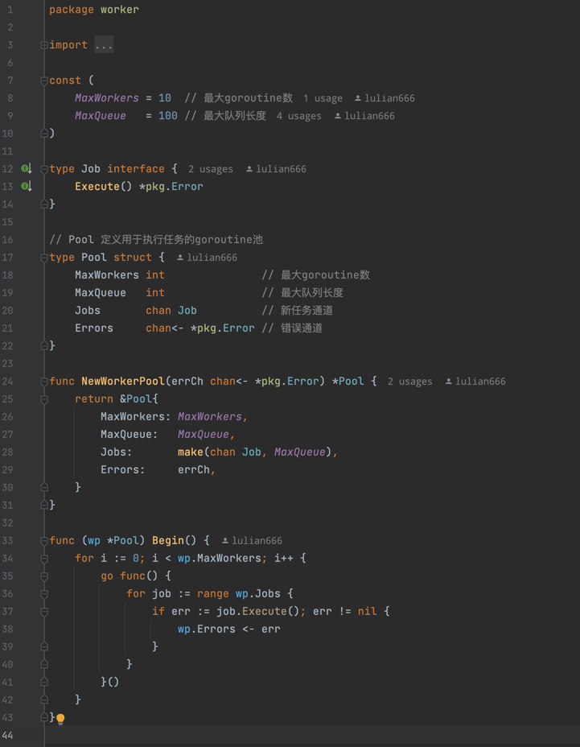
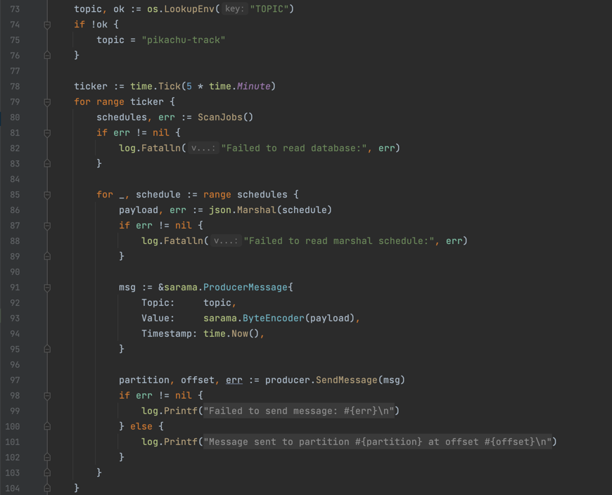
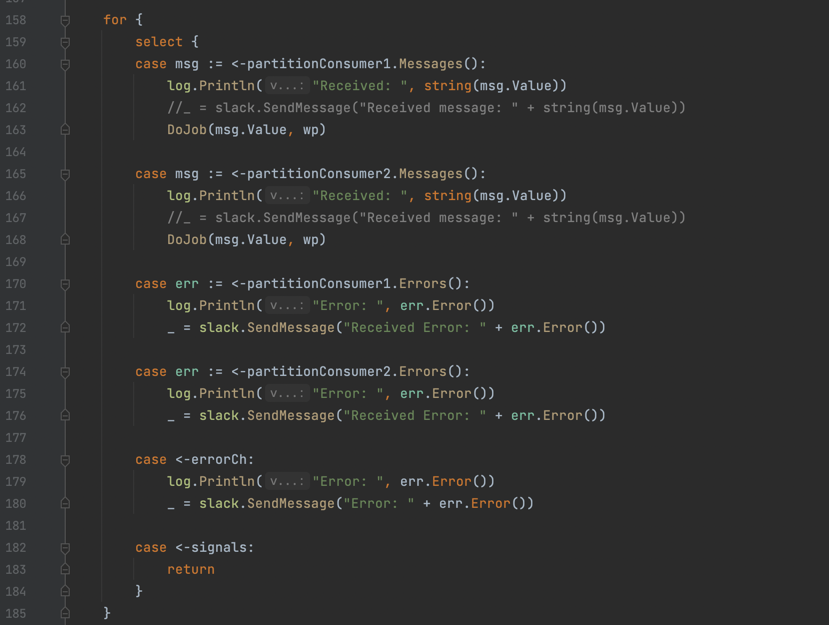
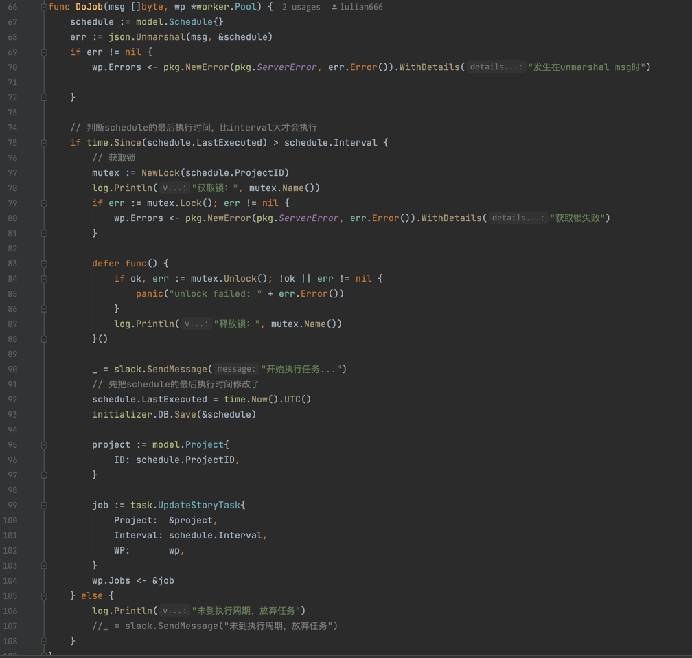

<a name="readme-top"></a>

<!-- PROJECT LOGO -->
<br />
<div align="center">
  <a href="https://github.com/lulian666/TrackMaster">
    
  </a>

<h3 align="center">Track Master</h3>

  <p align="center">
    Keep on Track
    <br />
    
  </p>
</div>


<!-- TABLE OF CONTENTS -->
<details>
  <summary>Table of Contents</summary>
  <ol>
    <li>
      <a href="#about-the-project">About The Project</a>
      <ul>
        <li><a href="#built-with">Built With</a></li>
      </ul>
    </li>
    <li>
      <a href="#getting-started">Getting Started</a>
      <ul>
        <li><a href="#installation">Installation</a></li>
      </ul>
    </li>
    <li><a href="#feature">Feature</a></li>
  </ol>
</details>


<!-- ABOUT THE PROJECT -->
## About The Project

Being a great assistant for Testers, Track Master not only helps you test user action data without causing you any frustration, but also saves you huge amount of time. You will no longer missing any test case or overlooking a bug that's too difficult for naked eyes to discover.


<p align="right">(<a href="#readme-top">back to top</a>)</p>


### Built With

* [Gin][Gin-url]
* [MySQL][MySQL-url]
* [Kafka][Kafka-url]
* [Redis][Redis-url]


<p align="right">(<a href="#readme-top">back to top</a>)</p>


<!-- GETTING STARTED -->
## Getting Started
You'll need a mysql database, a kafka environment, a redis server, and of course, your Go installed.
Note: This is not a detailed step-by-step installation instruction because you have to correctly install all the requirements before you can run this project. 

### Installation

1. After setting up your database, make migrations
    ```sh
   go run migrate/migrate
   ```
2. Create a topic 'pikachu-track' with 2 partitions 
   ```sh
   bin/kafka-topics.sh --create --topic pikachu-track  --partitions 2 --replication-factor 1 --bootstrap-server localhost:9092
   ```
3. Set up environment variables however you like. File ./.env.example lists all the variables you need

4. Build project
   ```sh
   make build
   ```
5. Run Producer, Consumer, TrackMaster
6. Checkout Api docs
    ```azure
    ${your_host_name}/swagger/index.html#/
    ```


<p align="right">(<a href="#readme-top">back to top</a>)</p>


<!-- FEATURES -->
## Feature
### RealTime Testing
After start a realtime test, we start a goroutine that checks the status of this test.
If it's still on than it creates a new job that fetches the newest track data and put this job
in to a channel. If it's off or achieve the limit, the ticker will stop.



This channel belongs to a worker pool that constantly watch for jobs to execute.
Any data structure that implement Job interface can be added into this channel.



### Periodic Task
In this project, there's a feature that depends on constantly updating our stories(the feature testers need to test).

Since go's time.ticker is not suitable for long term tasks like periodic task because 
1. we want more control on how often a task should apply
2. we don't want our goroutine that's doing our job got shut down during updating pods or someting like that

I chose to use message queue to pass work between two services. You can see in producer/producer.go
that every 5 minutes the producer read from database to see how many jobs we have and write messages to a topic.


The consumer in consumer/consumer.go listens to the topic, sends some messages to notify testers and execute the job.


Before doing the job, the consumer checks the interval time to make sure it has been long enough from last executed or else it drops the job.
It also acquires a lock before executing the task and unlock it afterwords.


<p align="right">(<a href="#readme-top">back to top</a>)</p>


[Redis-url]: https://redis.io/
[Kafka-url]: https://kafka.apache.org/
[MySQL-url]: https://www.mysql.com/
[Gin-url]: https://gin-gonic.com/ 
